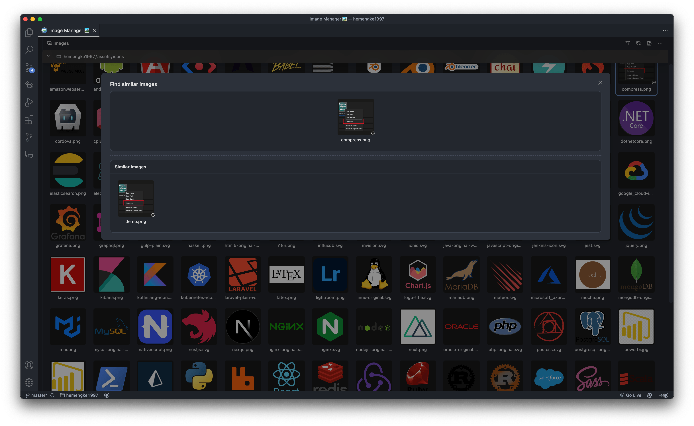

  

<h1 align='center'>Image Manager</h1>

> 压缩、裁剪、转换格式、搜索、查找相似图片的vscode插件

[English README](./README.en.md)

## [更新日志](./CHANGELOG.md)

## 插件截图

  
概览

  
大图预览

  
压缩

  
裁剪

  
查找相似图片

  
搜索图片

## 核心功能

- **图片批量压缩**
- **图片裁剪**
- **图片大图浏览**
- **相似图片查找**
- 支持多选(shift/ctrl/cmd)
- 查看图片详情（尺寸、体积等）
- 查找图片
- 条件筛选图片（根据git-staged/图片大小/是否已压缩筛选）
- 暗黑/明亮主题，自定义UI主题色
- 国际化。目前支持 `english`，`简体中文`，`繁體中文`，`日本語`

## 使用方法

**有以下几种方式打开插件**

### 1.快捷键

- windows: `shift+alt+j`
- macos: `cmd+option+j`

### 2.右键菜单

资源管理器中右键选择 `Image Manager 🏞️` 打开插件

### 3.命令面板

`ctrl+shift+p` (macos `cmd+shift+p`) 打开命令面板, 输入 `Image Manager` 选择打开

## [插件配置项](./docs/vscode-configuration.md)

## 小贴士

### 关于配置

大部分配置可以在插件页面中设置，比如主题、语言等，当然也可以在 `settings.json` 中设置

### 压缩

- 在图片上右键，可以单独压缩一张图片

- 在文件夹上右键，可以批量压缩文件夹下的图片

### 浏览区域

- `cmd/ctrl + 鼠标滚轮` 可以缩放图片大小
- `cmd/ctrl + F` 可以打开搜索窗口

### 常见问题

#### 为什么第一次打开插件很慢？

由于首次打开插件时，需要下载必要依赖，此过程跟您的网络环境有关，可能会比较慢，请耐心等待

#### 报错：依赖安装失败，请检查网络

如果您是在中国大陆，且网络环境不佳（懂的都懂）
有两种解决方案：

1. 切换镜像源
2. 手动安装依赖

##### 如何切换镜像源

使用命令面板，输入 `select mirror url`，选择回车

然后选择一个镜像源，重启vscode尝试重新下载依赖

如果切换镜像源之后依然安装失败，请手动安装依赖

##### 如何手动安装依赖

1. 打开命令面板，输入 `Show Output Channel`，选择 Image Manager 对应的选项
2. 在输出中找到 `插件根目录 (Extension Root)`，之后需要用到
3. 下载 `Output Channel` 中打印的依赖地址
4. 将下载的文件放在 步骤2 的`插件根目录`
5. 重启vscode即可

#### 为什么压缩后文件反而变大了？

- 由于压缩时添加了「是否已压缩」的元信息，所以可能导致小体积图片压缩后变大
- 您可以设置 `image-manager.compression.errorRange` 来调整压缩误差范围

#### 图片太多，感觉卡顿怎么办？

- 可以配置 `image-manager.appearance.reduceMotion: 'on'` 减少动画效果
- 可以使用右键文件夹的方式打开指定的目录，从而减少渲染的图片数量

## 赞赏

> 如果这个插件能帮助到您，请作者喝杯咖啡吧:) ☕️
>
> 或者动动小手指[点个star](https://github.com/hemengke1997/vscode-image-manager)⭐️

| 微信                                                   | 支付宝                                              |
| ------------------------------------------------------ | --------------------------------------------------- |
|  |  |

## 感谢

❤️ [vscode-image-viewer](https://github.com/ZhangJian1713/vscode-image-viewer)

❤️ [vscode-svgo](https://github.com/1000ch/vscode-svgo)
